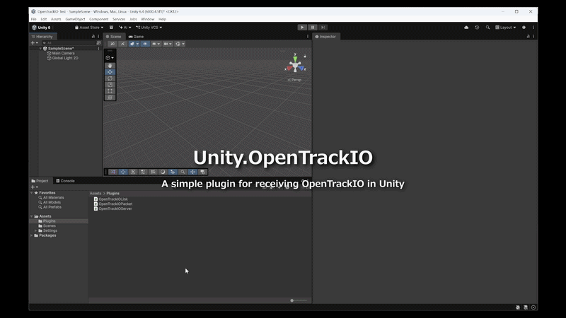

# Unity.OpenTrackIO

> **Warning:** This repository is a simple example for getting started with OpenTrackIO in Unity. It is not a fully finalized integration and should be extended and tested before use in production environments.
>
> The current implementation is a prototype and has not been fully verified for runtime behavior in Unity.

Unity.OpenTrackIO is an experimental Unity plugin skeleton for receiving OpenTrackIO data over UDP and mapping it to Unity camera and transform values.

## Overview

- Listens only on UDP port `40000`.
- Implements an OpenTrackIO packet parser that supports OTIO v1.0.1-compatible JSON payloads.
- Parses the OpenTrackIO header and extracts fields such as `sourceNumber`, `transforms`, `lens`, `protocol`, `static`, and `custom`.
- Maps received OpenTrackIO data into Unity objects and exposes a starting point for further integration.

## File Responsibilities

- `OpenTrackIOServer.cs`
  - Creates and manages a UDP listener on port `40000`.
  - Receives raw OpenTrackIO UDP packets.
  - Hands packet payloads to `OpenTrackIOPacket.Decode`.
  - Raises parsed packet events to the Unity scene.

- `OpenTrackIOPacket.cs`
  - Parses the OpenTrackIO packet header.
  - Extracts JSON payload data from OTIO-formatted packets.
  - Deserializes the full OpenTrackIO data structure into Unity-friendly classes.
  - Exposes values such as `sourceNumber`, `transforms`, `lens`, `static`, `protocol`, and `custom`.

- `OpenTrackIOLink.cs`
  - Attaches to a Unity `Camera` GameObject.
  - Subscribes to `OpenTrackIOServer` packet events.
  - Maps received OpenTrackIO transform values to Unity object position and rotation.
  - Calculates and applies camera parameters such as `fieldOfView` and `focusDistance`.

## Status

- This plugin is intended as a starting template for using OpenTrackIO in Unity.
- It has not yet been fully verified for runtime behavior in Unity.
- Users should consider this repository a prototype and continue to validate behavior against their own OpenTrackIO sources.

## OpenTrackIO Compatibility

- This implementation is based on OpenTrackIO v1.0.1.
- Please refer to the official OpenTrackIO specification at:

  https://ris-pub.smpte.org/ris-osvp-metadata-camdkit/

## Notes

- The plugin is currently hard-coded to receive only on UDP port `40000`.
- `OpenTrackIOLink.cs`, `OpenTrackIOPacket.cs`, and `OpenTrackIOServer.cs` have been updated to support the current OpenTrackIO packet structure.
- The intent is for OpenTrackIO data to be reflected in Unity camera properties and transform values, but this remains a starting point rather than a complete production-ready implementation.

## Usage

1. Create a folder named Plugins under the Assets directory and copy `OpenTrackIOLink.cs`, `OpenTrackIOPacket.cs`, and `OpenTrackIOServer.cs` into it.
2. Create an Empty Object in the Hierarchy and name it `OpenTrackIO` (or any name you prefer).
3. Attach the scripts: Add both `OpenTrackIOServer` and `OpenTrackIOLink` to the object created in the previous step.
4. Start sending OpenTrackIO packets to UDP port 40000.
5. The OpenTrackIO node will now begin receiving and processing the data.

## Disclaimer

This repository is a simple example for getting started with OpenTrackIO in Unity. It is not a fully finalized integration and should be extended and tested before use in production environments.
